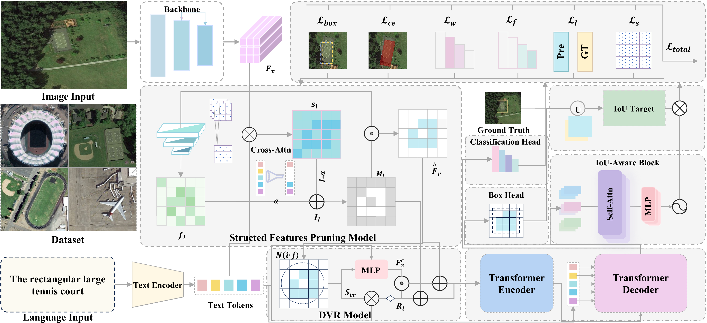

# PR-VG: Text-Guided Structured Feature Pruning with Dynamic Visual Reconstruction for Reliable Remote Sensing Visual Grounding

**Long Sun**, Ziyang Wang, Xu Liu, Licheng Jiao, Shuo Li, Ruozhang Zhang, Fang Liu, Xiaowen Zhang

<!-- Preprint, under review -->



## 📝 Abstract

Remote Sensing Visual Grounding (RSVG) aims to localize objects in high-resolution RS imagery according to natural language queries, yet remains fundamentally constrained by the mismatch between sparse semantic intent and densely redundant visual observations. In large-scale aerial scenes, targets of interest typically occupy only a small fraction of the spatial domain, while existing methods uniformly process all visual tokens, leading to substantial computational redundancy, inefficient cross-modal reasoning, and unstable localization under complex background clutter. 

In this paper, we propose a novel query-conditioned sparse grounding framework (PR-VG) that jointly addresses efficiency and reliability through structured feature optimization. Specifically, we introduce a **text-guided Structured Feature Pruning (SFP)** paradigm that injects query-conditional sparsity into the grounding pipeline by progressively filtering semantically irrelevant visual tokens using cross-modal importance modeling, thereby substantially reducing redundant computation while retaining global contextual awareness. To mitigate structural fragmentation caused by aggressive pruning, we further design a **Dynamic Visual Reconstruction (DVR)** mechanism that selectively recovers structurally coherent regions via neighborhood aggregation and text-visual similarity reasoning, ensuring continuity of target structures. Moreover, we present an **IoU-Aware Block (IAB)** that explicitly models localization quality within the Transformer decoder, providing reliability-aware supervision to refine grounding predictions and accelerate convergence under sparse feature representations. 

Extensive experiments on challenging DIOR-RSVG and OPT-RSVG benchmarks demonstrate that the proposed framework establishes a new efficiency-accuracy trade-off for RSVG. Our best-performing model achieves state-of-the-art grounding performance while reducing FLOPs by approximately 30% and significantly lowering training time and memory consumption. These results indicate that PR-VG offers a scalable and reliable paradigm for high-resolution RSVG, advancing the development of efficient multimodal geospatial understanding systems.

**Code and dataset are available at:** [https://github.com/Pokemore/PR-VG](https://github.com/Pokemore/PR-VG)

## ✨ Key Features

- **Text-Guided Structured Feature Pruning (SFP)**: Progressively filters semantically irrelevant visual tokens using cross-modal importance modeling
- **Dynamic Visual Reconstruction (DVR)**: Selectively recovers structurally coherent regions to prevent fragmentation
- **IoU-Aware Block (IAB)**: Explicitly models localization quality for reliability-aware supervision
- **Efficiency Gains**: Reduces FLOPs by ~30% and training time by over 14% while maintaining competitive accuracy
- **State-of-the-Art Performance**: Achieves 74.03 meanIoU and 82.55 cumIoU on DIOR-RSVG

## 🚀 Quick Start

### Installation & Environment

1. Clone the repository:
```bash
git clone https://github.com/Pokemore/PR-VG.git
cd PR-VG
```

2. Create a conda environment (Python 3.10):
```bash
conda create -n prvg python=3.10
conda activate prvg
```

3. Install PyTorch (matching our experiments, CUDA 13.0):
```bash
pip install torch==2.9.0+cu130 torchvision==0.24.0+cu130 torchaudio==2.9.0+cu130 --index-url https://download.pytorch.org/whl/cu130
```

4. Install other Python dependencies:
```bash
pip install \
  transformers==4.57.1 \
  einops==0.8.1 \
  numpy==2.1.2 \
  scipy==1.15.3 \
  pillow==11.3.0 \
  opencv-python==4.12.0.88 \
  pandas==2.3.3 \
  matplotlib==3.10.7 \
  tqdm==4.67.1 \
  spconv-cu118==2.3.8 \
  pycocotools==2.0.10
```

5. Compile the MultiScaleDeformableAttention module:
```bash
cd Code/models/ops
python setup.py build install
cd ../../..
```

### Dataset Preparation

#### DIOR-RSVG
1. Download the DIOR-RSVG dataset from [Google Drive](https://drive.google.com/drive/folders/1hTqtYsC6B-m4ED2ewx5oKuYZV13EoJp_?usp=sharing)
2. Organize the dataset structure:
```
Dataset/
└── DIOR_RSVG/
    ├── Annotations/
    │   ├── 00001.xml
    │   └── ... (more XML files)
    ├── JPEGImages/
    │   ├── 00001.jpg
    │   └── ... (more JPG files)
    ├── train.txt
    ├── val.txt
    └── test.txt
```

#### OPT-RSVG
1. Download the OPT-RSVG dataset from the [official GitHub repository](https://github.com/like413/OPT-RSVG) (TGRS 2024)
2. Organize the dataset structure:
```
Dataset/
└── OPT-RSVG/
    ├── Annotations/
    │   └── ... (XML files)
    ├── JPEGImages/
    │   └── ... (JPG files)
    ├── train.txt
    ├── val.txt
    └── test.txt
```

### Download Pretrained Models

1. **RoBERTa-base** text encoder:
```bash
mkdir -p Pretrain
cd Pretrain
git clone https://huggingface.co/roberta-base RoBERTa-base
cd ..
```

2. **ResNet-50** backbone (ImageNet pretrained, automatically downloaded by torchvision)

## 🏋️ Training

**Note:** All training scripts should be run from the `Code/` directory. The scripts automatically change to the correct working directory.

### DIOR-RSVG Training

#### PR-VG
```bash
bash Shell/Result/DIOR-RSVG/PR-VG/PR-VG_train.sh
```

#### PR-VG-B
```bash
bash Shell/Result/DIOR-RSVG/PR-VG-B/PR-VG-B_train.sh
```

#### PR-VG-L
```bash
bash Shell/Result/DIOR-RSVG/PR-VG-L/PR-VG-L_train.sh
```

### OPT-RSVG Training

#### PR-VG
```bash
bash Shell/Result/OPT-RSVG/PR-VG/PR-VG_train.sh
```

#### PR-VG-E
```bash
bash Shell/Result/OPT-RSVG/PR-VG-E/PR-VG-E_train.sh
```

#### PR-VG-C
```bash
bash Shell/Result/OPT-RSVG/PR-VG-C/PR-VG-C_train.sh
```

### Training Configuration

Key hyperparameters:
- **Pruning Ratios**: Different variants use different progressive pruning ratios
  - PR-VG (DIOR): `0.45 0.35 0.30 0.18`
  - PR-VG-B (DIOR): `0.35 0.25 0.20 0.10`
  - PR-VG-L (DIOR): `0.30 0.20 0.10 0.00`
  - PR-VG (OPT): `0.60 0.50 0.45 0.38`
  - PR-VG-E (OPT): `0.55 0.45 0.40 0.30`
  - PR-VG-C (OPT): `0.45 0.40 0.35 0.18`
- **Learning Rates**: 
  - Transformer: `1e-4`
  - Backbone: `5e-5`
  - Text Encoder: `1e-5`
- **Training**: 70 epochs with learning rate decay at epochs 40 and 60

## 🔍 Inference

### DIOR-RSVG Inference

```bash
bash Shell/Result/DIOR-RSVG/PR-VG/PR-VG_test.sh
```

Or use Python directly:
```bash
python inference_rsvg1.py \
    --resume /path/to/checkpoint.pth \
    --eval \
    --dataset_file rsvg \
    --rsvg_path ../Dataset/DIOR_RSVG \
    --backbone resnet50 \
    --tokenizer_path ../Pretrain/RoBERTa-base \
    --text_encoder_path ../Pretrain/RoBERTa-base \
    --use_pruning \
    --progressive_pruning \
    --pruning_ratios 0.45 0.35 0.3 0.18 \
    --use_dvr \
    --use_iou_head
```

### OPT-RSVG Inference

```bash
bash Shell/Result/OPT-RSVG/PR-VG/PR-VG_test.sh
```

## 📊 Results

### DIOR-RSVG Results

| Method | Pr@0.5 | Pr@0.6 | Pr@0.7 | Pr@0.8 | Pr@0.9 | meanIoU | cumIoU |
|--------|--------|--------|--------|--------|--------|---------|--------|
| LQVG | 82.48 | 79.47 | 74.47 | 64.21 | 42.19 | 73.02 | 81.70 |
| PR-VG | 82.67 | 80.32 | 75.29 | 63.84 | 41.93 | 73.24 | 81.92 |
| **PR-VG-B** | **83.49** | 80.12 | **76.09** | **65.0** | **43.6** | **74.03** | 82.55 |
| PR-VG-L | 83.91 | **80.65** | 75.57 | 64.43 | 42.47 | 73.81 | 82.59 |


### OPT-RSVG Results

| Method | Pr@0.5 | Pr@0.6 | Pr@0.7 | Pr@0.8 | Pr@0.9 | meanIoU | cumIoU |
|--------|--------|--------|--------|--------|--------|---------|--------|
| LPVA | 76.43 | 71.17 | 61.71 | 44.59 | 15.52 | 64.56 | 75.47 |
| **PR-VG** | **80.40** | **76.97** | **69.19** | **50.98** | 18.25 | **67.64** | 75.62 |
| PR-VG-E | 80.27 | 76.87 | 68.82 | 50.88 | 18.63 | 67.48 | **75.67** |

### Efficiency Analysis

**DIOR-RSVG:**
- PR-VG reduces FLOPs by ~40% and training time by 20.1%
- PR-VG-B reduces FLOPs by ~30% and training time by 14.3% (best accuracy)
- PR-VG-L reduces FLOPs by ~26% and training time by 12.7%

**OPT-RSVG:**
- PR-VG reduces FLOPs by ~44% and training time by 24.3%
- PR-VG-E reduces FLOPs by ~48% and training time by 12.1%
- PR-VG-C reduces FLOPs by ~42% and training time by 11.9%

## 🔬 Ablation Studies

### Component Analysis (DIOR-RSVG)

| Variant | Pruning | DVR | IoU | Time/Epoch | meanIoU | cumIoU | Pr@0.7 |
|---------|---------|-----|-----|------------|---------|--------|--------|
| Baseline | - | - | - | 14.40m | 73.02 | 81.7 | 74.47 |
| Only Pruning | ✓ | - | - | **11.07m** | 72.88 | 81.58 | 74.27 |
| w/o IoU | ✓ | ✓ | - | 12.07m | 73.18 | **82.11** | 74.63 |
| w/o DVR | ✓ | - | ✓ | 12.58m | 73.08 | 81.51 | 75.25 |
| **Full Model** | ✓ | ✓ | ✓ | 11.53m | **73.24** | 81.92 | **75.29** |

### Component Analysis (OPT-RSVG)

| Variant | Pruning | DVR | IoU | Time/Epoch | meanIoU | cumIoU | Pr@0.7 |
|---------|---------|-----|-----|------------|---------|--------|--------|
| Baseline | - | - | - | 11.18m | 67.28 | **76.5** | 68.68 |
| Only Pruning | ✓ | - | - | 8.57m | 66.99 | 75.46 | 68.4 |
| w/o IoU | ✓ | ✓ | - | **8m** | 66.92 | 74.7 | 68.06 |
| w/o DVR | ✓ | - | ✓ | 7.92m | 66.73 | 75.07 | 67.31 |
| **Full Model** | ✓ | ✓ | ✓ | 8.46m | **67.64** | 75.62 | **69.19** |

## 🏗️ Model Architecture

PR-VG consists of three main components:

1. **Text-Guided Structured Feature Pruning (SFP)**
   - Cross-Modal Importance Scoring (CMIS)
   - Progressive Multi-Scale Pruning (PMSP)
   - Adaptive threshold mechanism

2. **Dynamic Visual Reconstruction (DVR)**
   - Neighborhood feature aggregation
   - Text-visual similarity reasoning
   - Selective feature recovery

3. **IoU-Aware Block (IAB)**
   - Self-attention across queries
   - Multi-layer MLP with residual connections
   - Quality-aware supervision